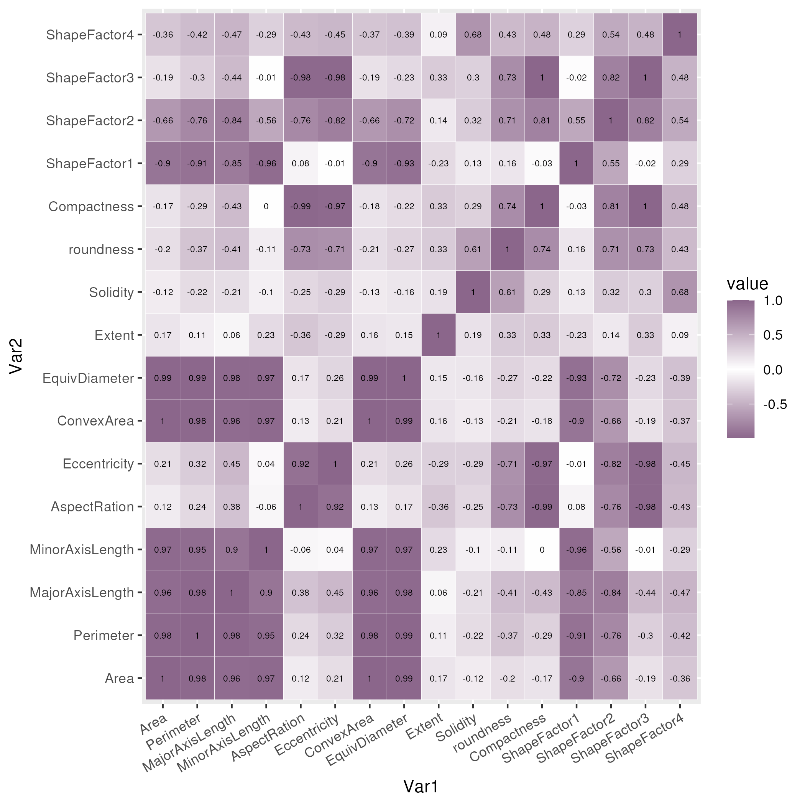
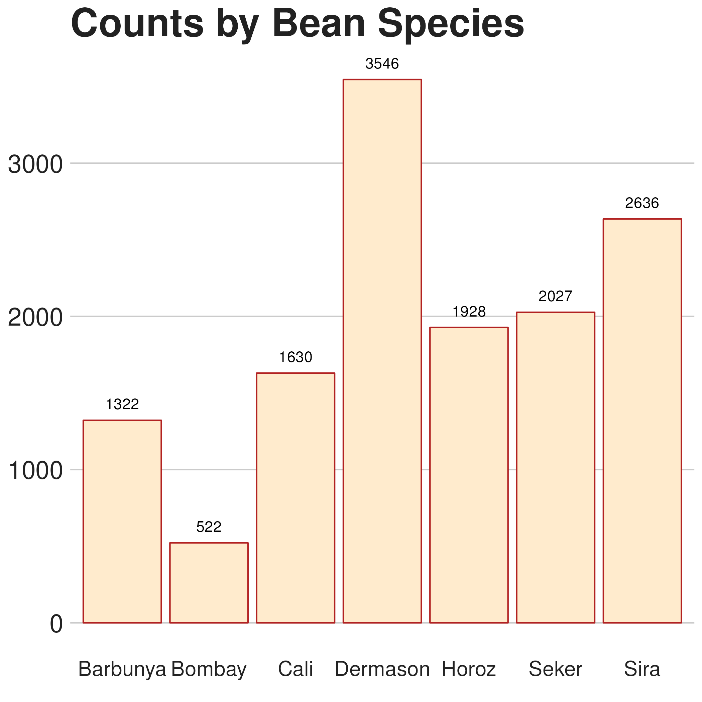

# Optimizing Models for Identification of Common Turkish Beans

## Introduction

Beans (and legumes) are a staple food for many cultures around the world and are associated with positive health outcomes such as improvement in cardiovascular health (Mullins & Arjmandi 2021), increases in antioxidant activity (Cardador-Martínez et al. 2002), and in general being excellent sources of vital nutrients (Winham et al. 2008). Naturally, the importance of beans in today's society has never been more apparent. While research into the differences between individual species of beans as opposed to beans and legumes in general has been somewhat sparse, it is likely that future research into the health benefits of *Fabaceae* will soon advance in this direction.

However, in order to examine the difference between different species of beans, it is imperative that researchers must first be able to identify and differentiate the species. A study conducted at the author's local supermarket store showed that most shoppers differentiate beans by color with all 6 respondents choosing color when asked about the primary differentiating characteristic between the available beans. Identifying through color may not always be an available option for the legume researchers of future generations, as it is not always the case that bean studies may take place under suitable light conditions.

Therefore, in order to prepare future generations for research into the potential of legumes, we must first seek to identify an ideally simple, yet accurate method to identify different species of beans through non-visual methods. In this report, I seek to determine whether such a method exists.

## Data Information

This dataset consists of a collection of 7 of the most common species of dry beans within Turkey. Each bean was photographed and information about its spatial attributes was recorded and then shared by M. Koklu and I.A. Ozkan.

## Narrowing the Scope of Analysis

Sixteen different attributes were recorded. However, while using all sixteen variables would be optimal strictly in terms of variance captured, it is highly likely that there exists some intercorrelation between the variables which would make them not all strictly necessary, thus likely trading off a small decrease in accuracy for a much larger decrease in complexity. We can first check where this intercorrelation is likely to exist through a correlation matrix of each variable.

From here, we can quickly see blocks of high correlation values $|\rho| > 0.9$ between several variables. Most of these are relatively clear, with `Area` having perfect correlation with `ConvexArea` or `Eccentricity` and `AspectRatio` being closely related, but examining this plot ensures we can quickly check for and throw out any pair which does not contribute too much additional information. For this study, we throw out any variable which has at least $\rho = 0.9$ with any already included variable. This gives us the following variables: `Area`, `AspectRatio`, `Extent`, `Solidity`, `Roundness`, `ShapeFactor2`, `ShapeFactor4`.

Additionally, we note that there was zero information given on the variable definitions. Therefore, while most of the variables are self-explanatory, it is impossible to know what the four shape factors found near the top and near the right sides of the correlation matrix refer to. Therefore, we exclude them from our analysis as well. Luckily, of the remaining ShapeFactors, `ShapeFactor2` has moderately strong correlation with `Area`, `AspectRatio`, and `Roundness`, so leaving it out is likely fine. `ShapeFactor4` is more questionable, as it only has a moderately strong relationship with `Solidity`, so we check by examining how much performance it contributes when included in a Naive Bayes Classifier with the remaining variables. However, before we can begin with such an analysis, we must first clean the variables.

## Scaling and Rebalancing the Data

Much like how not all species of beans are eaten equally throughout the world, this dataset does not contain an equal amount of each type of bean. Although most bean species have well over a thousand observations, we see that notably the Bombay bean was only recorded 522 times, so we seek to avoid the effects of sample sizes on our analysis by equalizing the sample sizes. We do this by selecting 500 random beans from each species.

We also have to scale the data. Most notably, `Area` is measured in pixels, whereas many of the other kept attributes range between 0 and 1. Therefore, we scale and normalize each variable to ensure the raw scale and both outliers have minimal impact on our analysis.

## Utilizing a Naive Bayes Classifier

We can finally move to classifying through Naive Bayes. First, we establish an 80/20 train/test split. As part of the training step, we run a Naive Bayes classifier with all of our kept variables, including Shape Factor 4, and then run another Naive Bayes Classifier with the same variables except Shape Factor 4, respectively the "with" and "without" models. We can then test our models by asking them to predict the species of each bean in the test split using only the variables they were trained on.

Our "with" model accurately predicted 622 beans out of 700 for an accuracy of 0.8886. Our "without" model predicted 609 beans out of 700 for an accuracy of 0.8700. We do expect the "with" model to perform better due to having an additional variable (and thus more data). However, the primary factor of interest is determining how many more beans the classifier was able to correctly identify with the addition of the `ShapeFactor4` data and determining whether the loss in interpretability is worth the additional boost in model strength.

 

Each species has 100 observations within its test set and we can see that by and large, wherever the "with" model fails to accurately predict a bean, the "without" model also fails, so it doesn't appear that the `ShapeFactor4` is actively hurting the model, it doesn't seem to be considerably improving the model. As both classified 604 correctly, including the `ShapeFactor4` improves accuracy by only about 3% (multiplicative), so we probably shouldn't keep it.

However, when breaking down by species of bean, we notice that for the Dermason bean, `ShapeFactor4` seems to help quite a bit, allowing for the model to capture 6 more out of the 16 remaining beans, for an improvement from 84% to 90%. The remaining beans seem to maintain the approximately 3% increase, so we decide not to keep it since it would need to be defined in terms of correlation with other variables. This is the same reason we chose not to proceed using PCA, so we continue to focus on interpretability and drop the variable from our final model.

We can take a look at the performance of our final NBC model in a different manner, examining the plots of beans using `Area` and `Extent` as our axes.

## Future Questions

While this work was relatively preliminary, future work could be done comparing how well a relatively interpretable model such as Naive Bayes performs in compared to more common ML models such as KNN, SVMs or random forests.

## References
Cardador-Martínez A, Loarca-Piña G, Oomah BD. Antioxidant activity in common beans (Phaseolus vulgaris L.). J Agric Food Chem. 2002 Nov 20;50(24):6975-80. doi: 10.1021/jf020296n. PMID: 12428946.

Koklu, M. and Ozkan, I.A., (2020), Multiclass Classification of Dry Beans Using Computer Vision and Machine Learning Techniques. Computers and Electronics in Agriculture, 174, 105507.

Mullins, Amy & Arjmandi, Bahram. (2021). Health Benefits of Plant-Based Nutrition: Focus on Beans in Cardiometabolic Diseases. Nutrients. 13. 519. 10.3390/nu13020519. 

Winham, Donna & Webb, Densie & Barr, Amy. (2008). Beans and Good Health. Nutrition Today. 43. 201-209. 10.1097/01.NT.0000303354.21347.45. 